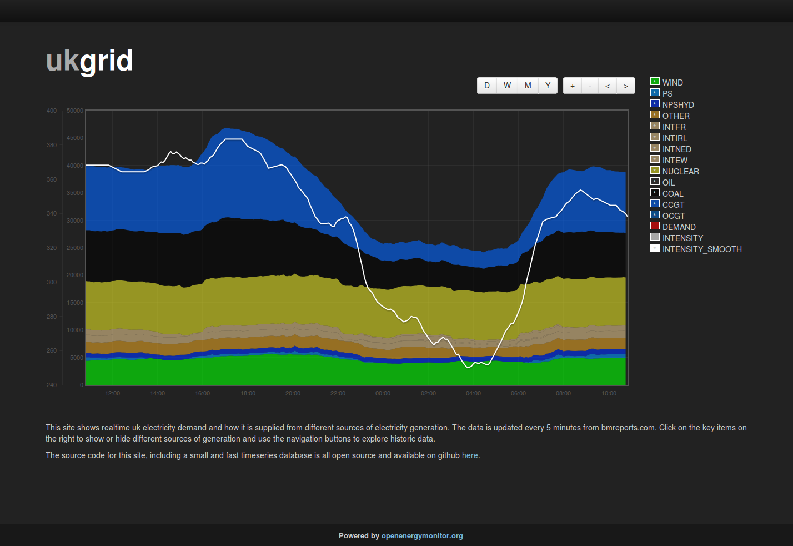

# ukgrid

Datalogging and visualisation tool for uk grid data and co2 intensity calculation.
 

## Live site:

[http://openenergymonitor.org/ukgrid/](http://openenergymonitor.org/ukgrid/)

This tool shows realtime uk electricity demand and how it is supplied from different sources of electricity generation. 

The data is updated every 5 minutes from bmreports.com.

## CO2 Intensity calculation

The intensity figures I used to calculate the grid intensity are from [GridCarbon](http://www.gridcarbon.uk/#calculation) a very nice mobile app showing realtime grid carbon. The intensity total is divided by 0.93 to reflect the 7% losses in the transmission and distribution networks.

<table>
  <tbody>
    <tr><td>Symbol</td><td>Fuel Type</td><td>Carbon Intensity (gCO2/kWh)</td>
    <tr><td>CCGT</td><td>Closed cycle gas turbine</td><td>360</td></tr>
    <tr><td>OCGT</td><td>Open cycle gas turbine</td><td>480</td></tr>
    <tr><td>COAL</td><td>Coal</td><td>910</td></tr>
    <tr><td>NUCLEAR</td><td>Nuclear</td><td>0</td></tr>
    <tr><td>WIND</td><td>Wind</td><td>0</td></tr>
    <tr><td>PS</td><td>Pumped storage</td><td>0</td></tr>
    <tr><td>NPSHYD</td><td>Non-pumped storage hydro</td><td>0</td></tr>
    <tr><td>OTHER</td><td>Other</td><td>300</td></tr>
    <tr><td>OIL</td><td>Oil</td><td>610</td></tr>
    <tr><td>INTFR</td><td>French Interconnector</td><td>90</td></tr>
    <tr><td>INTIRL</td><td>Irish Interconnector</td><td>450</td></tr>
    <tr><td>INTNED</td><td>Dutch Interconnector</td><td>550</td></tr>
    <tr><td>INTEW</td><td>East-West Interconnector</td><td>450</td></tr>
  </tbody>
</table>
